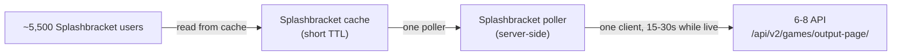

# 6-8 Live Scores API — Integration Spec for Splashbracket

## 1. Overview

6-8 Sports runs the live scoring for water-polo games — the same data that powers the public scoreboard at `https://scores.6-8sports.com`. This spec lets Splashbracket read that live score data and render it inline, right next to the games your users are already looking at.

What you get:

- **Live scores inline.** For a game that is in progress, a current score for each team, updated as the game unfolds.
- **A 6-8 badge.** A small 6-8 logo on any game that has a live score, so users know richer data is one tap away.
- **A deep link back to 6-8.** A tap-through to the 6-8 scoreboard for full play-by-play detail — your users promote 6-8, and 6-8 adds live value to your app.

---

## 2. Quick start

A single public `GET` call returns the games that are live right now. No `Authorization` header, no credentials.

```bash
curl "https://api.6-8sports.com/api/v2/games/output-page/?game_type=in_progress&limit=25&offset=0"
```

You get back a paginated envelope. Each element of `results` is one game. The live-score fields are `dark_team_score`, `light_team_score`, and the `in_progress` flag:

```json
{
  "count": 153,
  "next": { "limit": 1, "offset": 1 },
  "previous": null,
  "results": [
    {
      "pk": "18fb32b5-4ab8-4073-87f0-8fc406e63f08",
      "name": "6-8 Academy: 7/17 Boys Scrimmag",
      "in_progress": true,
      "dark_team_name": "6-8 Summer Academy: 2026",
      "light_team_name": "6-8 Summer Academy: 2026",
      "dark_team_score": 21,
      "light_team_score": 22,
      "schedule_date": null,
      "schedule_time": null
    }
  ]
}
```

That is the whole read path. The rest of this spec is detail: the full field list, the pitfalls to route around, and the caching architecture that keeps 6-8's database healthy while you serve thousands of users.

---

## 3. Endpoint reference

### `GET /api/v2/games/output-page/`

Returns a paginated list of games. This is a **public** endpoint: send **no** `Authorization` header and **no** `X-*` headers (`X-Platform`, `X-Version`, `X-Application`). It is the same endpoint that powers the public scoreboard at `https://scores.6-8sports.com`.

**Base URL (production):** `https://api.6-8sports.com`

#### Query parameters

| Parameter | Type | Required | Description |
|---|---|---|---|
| `game_type` | string | No | Which set of games to return: `in_progress`, `finished`, or `upcoming`. For live scores, use `in_progress`. |
| `limit` | integer | No | Page size — how many game records to return per call. |
| `offset` | integer | No | Pagination offset. Verified to page (an `offset` of `0` and an `offset` of `5` return different records). |

> **Only two date-filter parameters work.** `created_from` and `created_to` (ISO date or date-time) filter correctly server-side; a malformed value returns HTTP 400. `created_at_after`, `start_date`, and `schedule_date_after` are silently ignored — they return HTTP 200 with no filtering applied. See [Section 4](#4-pitfalls).

#### Response envelope

Every response is a paginated envelope:

```json
{ "count": 153, "next": <object|null>, "previous": <object|null>, "results": [ <game>, ... ] }
```

| Field | Type | Description |
|---|---|---|
| `count` | integer | Total number of games matching the `game_type`, across all pages. |
| `next` | object or null | Pagination cursor for the next page (`limit`/`offset`), or `null` on the last page. |
| `previous` | object or null | Pagination cursor for the previous page, or `null` on the first page. **Known 6-8 bug:** in practice this mirrors `next`'s forward offset rather than pointing backward — do not rely on it; track `offset` client-side instead. |
| `results` | array | The array of game records for this page. |

#### Game record fields

Each element of `results` is one game. The **live-score fields** are marked below.

| Field | Type | Description |
|---|---|---|
| `pk` | string (UUID) | Game ID. Use it to dedupe, to key a game in your cache, and for the deep link. |
| `name` | string | Game name. May be truncated at the source (see [Section 4](#4-pitfalls)). |
| `in_progress` | boolean | **Live-score field.** `true` means the game is live right now. |
| `dark_team_score` | integer | **Live-score field.** Current score for the dark-cap team. |
| `light_team_score` | integer | **Live-score field.** Current score for the light-cap team. |
| `dark_team_name` | string | Name of the dark-cap team. |
| `light_team_name` | string | Name of the light-cap team. |
| `dark_team_id` | string (UUID) | 6-8 team ID for the dark-cap team. Useful later for an optional team-ID map (see [Section 6](#6-matching-a-6-8-game-to-a-splashbracket-game)). |
| `light_team_id` | string (UUID) | 6-8 team ID for the light-cap team. |
| `dark_team_avatar` | string (URL) | Dark-cap team logo. |
| `light_team_avatar` | string (URL) | Light-cap team logo. |
| `schedule_date` | string (date) or null | Scheduled date, when present. Useful as a secondary match key. |
| `schedule_time` | string (time) or null | Scheduled time, when present. |
| `created_at` | string (ISO 8601, UTC) | When the game record was created. |
| `history` | object | Play-by-play buckets (`goals`, `assists`, `exclusions`, and more). Each event carries `type`, `datetime`, `team_color` (`"Dark Team"` or `"Light Team"`), `player` (UUID), and `quarter` (for example, `"Period 1"`). Use it to derive the current period for an expanded score view. |
| `players` | array | Full roster with per-player stats. Large — skip it for a score badge. |
| `performance_coefficients` | object | Scoring weights. Not needed for a score badge. |
| `referee_one` | string or null | Referee name, if recorded. |
| `referee_two` | string or null | Second referee name, if recorded. |
| `is_shared` | boolean | Whether the game is shared. |
| `synced` | boolean | Sync state of the scoring device. |
| `device_id` | string | Scoring-device identifier. |
| `note` | string or null | Free-text note. |
| `note_reason` | string or null | Reason attached to a note. |

**Reading the current period.** The scalar fields do not carry a "current period" value directly. To show it, take the most recent event across the `history` buckets and read its `quarter` field (for example, `"Period 4"`). In the captured sample, the latest event is a `Period 4` time-out, so the game is in its fourth period.

---

## 4. Pitfalls

**Only `created_from`/`created_to` filter by date server-side — the rest are silent no-ops.** Verified against production:

- `created_from` and `created_to` (ISO date, for example `2026-06-01`, or a full ISO date-time) correctly narrow the result set; a malformed value returns HTTP 400.
- `created_at_after`, `start_date`, and `schedule_date_after` return HTTP 200 but are **silently ignored** — the count is identical to the unfiltered result.

For the live-scores use case, this rarely matters in practice: filter by `game_type=in_progress` and let the small live set decide what to show, rather than reaching for a date filter. If you do need a date-bounded historical query, use `created_from`/`created_to` server-side rather than paging the full `finished` history and filtering client-side.

**Names may be truncated at the source.** The `name` field can arrive clipped — a real captured example is `"6-8 Academy: 7/17 Boys Scrimmag"` (note the cut-off word). Do not treat `name` as a reliable full title, and lean on `dark_team_name` / `light_team_name` for matching (see [Section 6](#6-matching-a-6-8-game-to-a-splashbracket-game)).

**Poll the small set, not the whole history.** At probe time there were roughly 153 games in progress and about 18,643 finished. The `in_progress` set is small and cheap. Poll `game_type=in_progress`; do not poll the full finished history.

---

## 5. Recommended architecture

**One server-side poller plus a short-TTL cache.** Splashbracket's backend polls 6-8 on a sane cadence, caches the result, and serves all users from that cache. From 6-8's side, thousands of Splashbracket users look like **one** client.



**Cadence and etiquette:**

- Poll `game_type=in_progress` every **15-30 seconds while games are live**. Anything from every 5 seconds to every 10 minutes is workable — 15-30 seconds is a sensible default that keeps scores fresh without straining the backend.

- Poll **nothing when no games are live.** When a poll returns an empty `in_progress` set, stop polling until your own schedule says a game is due to start.
- Set the cache TTL at or near the poll interval, so users always read a recent value and the poller stays the only thing talking to 6-8.
- **Back off on HTTP 503.** A `503` (served by `awselb/2.0`) means the backend is under pressure — wait and retry with a longer delay. Do not retry-storm. There is no ETag or conditional-GET guarantee, so rely on your own caching rather than the server to deduplicate work.

---

## 6. Matching a 6-8 game to a Splashbracket game

Splashbracket will not have 6-8's team UUIDs on day one, so v1 matching is name-based.

**v1 — normalized name match (recommended to start):**

1. Normalize `dark_team_name` and `light_team_name` from 6-8 (lowercase, trim whitespace, collapse internal spaces, strip punctuation) and compare against your normalized team names.
2. When `schedule_date` is present on the 6-8 record, use it as a secondary key to disambiguate two games between the same teams.
3. Because the team pairing is unordered (dark and light are cap colors, not fixed sides), match on the **set** of two team names rather than a fixed dark-then-light order.

**v2 — look up team UUIDs directly (recommended once you're ready):**

6-8 exposes a public, unauthenticated team-search endpoint you can use to build your own ID map, on your own schedule, rather than waiting to see each team in a game feed:

```bash
curl "https://api.6-8sports.com/api/v2/global-search/teams/?name=academy"
```

```json
{
  "count": 17,
  "next": { "limit": 5, "offset": 5 },
  "previous": null,
  "results": [
    { "pk": "47185e45-cd62-404f-b143-69264110051b", "name": "6-8 Fall Academy - 2024", "avatar": null },
    { "pk": "08273e20-190d-4264-b839-e6a3ed4eb1f7", "name": "6-8 Academy Athletes Fall", "avatar": null },
    { "pk": "069ccbb0-b513-4ec9-b852-7f6d40769978", "name": "White Team- Academy S3", "avatar": null }
  ]
}
```

- `name` is **required** — omitting it returns an HTTP 500, not an empty result. Always send a non-empty value.
- The match is a case-insensitive substring search (`name=academy` and `name=ACADEMY` return the same results).
- `pk` is the team's UUID — the same value that appears as `dark_team_id` / `light_team_id` on a game record.
- Team names are not guaranteed unique. Treat a multi-result response as expected, and have a person confirm the right `pk` per team rather than auto-selecting the first match.

Look up each of your teams once, store its 6-8 `pk` next to your own team record, and match future games on `dark_team_id` / `light_team_id` instead of names — an exact ID match is far more reliable than a name match and sidesteps truncation and spelling differences entirely. v1 name matching is enough to ship; treat this as a follow-up hardening step once your team roster is stable.

> **Watch out:** `/api/v2/teams/output-page/` is a different, similarly-named endpoint that requires authentication (HTTP 401). It is not a substitute for `global-search/teams` above, which is the one that's actually public.

---

## 7. UI integration

**The badge.** On any game where a matching 6-8 record has a live score (`in_progress` is `true`), show the 6-8 logo as a small badge next to the game. The badge is the signal to your users that live scoring is available.

**The expanded score.** Tapping the badge expands an inline live-score view. From a single game record you can render:

- The two teams (`dark_team_name`, `light_team_name`).
- The **dark vs. light score** (`dark_team_score` : `light_team_score`) — label them by cap color, not home/away.
- The current period, derived from the most recent event's `quarter` in `history` (see [Section 3](#3-endpoint-reference)).

For the sample game, that renders as: **6-8 Summer Academy: 2026 (dark) 21 — 22 (light), Period 4.**

**The deep link.** Build a per-game deep link directly from the game's `pk`:

```
https://scores.6-8sports.com/scoreboard/games/<pk>/play-by-play
```

**Confirmed live** against both an in-progress and a finished game: this route renders the real per-game detail — team names, scores, and a full play-by-play event log — not a generic app shell. Two things to build against:

- The trailing `/play-by-play` segment is required. Dropping it does not 404, but it renders only the score header with no tab selected and no detail content loaded.
- A nonexistent or malformed `pk` correctly 404s (the SPA redirects to its own not-found page), so it is safe to build this URL directly from `pk` with no pre-check. Content loads asynchronously after navigation — allow a couple of seconds before treating a blank render as broken.

---
